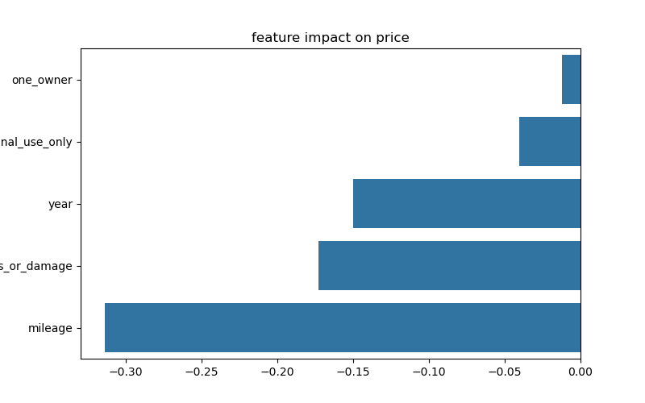
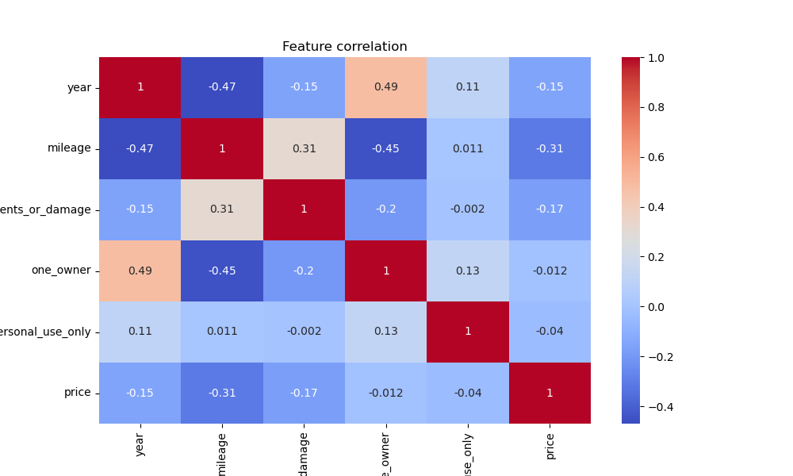
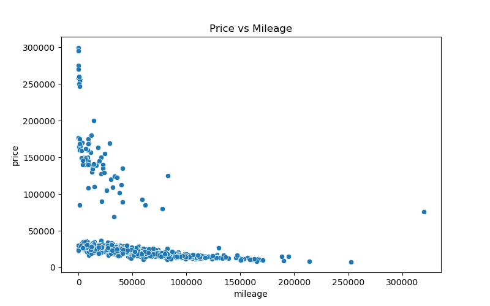
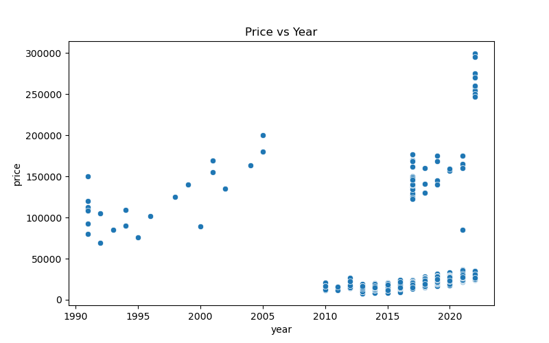

 🚗 Car Price Predictor

A complete end-to-end machine learning project that predicts used car prices and provides data-driven insights through visualization and an interactive web app.


 🚀 Live Demo

👉 https://car-price-predictor-z38wzd62smdnfs9pttspur.streamlit.app

 📌 Project Overview

This project uses a Random Forest Regressor** to estimate car prices based on features such as year, mileage, engine size, and more.

It also includes data visualization** to understand which factors influence car prices the most.


 🧠 Key Features

* 🔮 Predict car prices using machine learning
* 📊 Visualize feature impact on price
* ⚡ Interactive web app built with Streamlit
* 🧹 Data cleaning and preprocessing pipeline


 📊 Data Insights

 🔥 Feature Importance



 📊 Correlation Heatmap



 📉 Price vs Mileage



 📅 Price vs Year




 🛠️ Tech Stack

* **Python**
* **Pandas**
* **Scikit-learn**
* **Streamlit**
* **Matplotlib & Seaborn**


 ⚙️ How It Works

1. Data cleaning and preprocessing
2. Feature engineering (engine size, drivetrain, etc.)
3. Model training using Random Forest
4. Deployment with Streamlit
5. Visualization of insights


 📁 Project Structure

```
car-price-predictor/
│
├── app.py                 # Streamlit app
├── visualization.py       # Data analysis & plots
├── cars_small.csv         # Dataset (deployment version)
├── requirements.txt       # Dependencies
├── README.md              # Project documentation
```


 🧪 How to Run Locally

```bash
git clone https://github.com/your-username/car-price-predictor.git
cd car-price-predictor
pip install -r requirements.txt
streamlit run app.py
```


 💡 Key Learnings

* End-to-end machine learning workflow
* Data preprocessing and feature engineering
* Model training and prediction
* Building interactive data apps
* Deploying ML applications to the cloud


 🔮 Future Improvements

* Add more input features (brand, fuel type filters)
* Improve model accuracy with tuning
* Use interactive visualizations (Plotly)
* Deploy with larger dataset using cloud storage


 👩‍💻 Author

    Rahel
Electrical Engineer | Machine Learning & Automation Enthusiast


⭐ If you like this project, feel free to star the repository!
